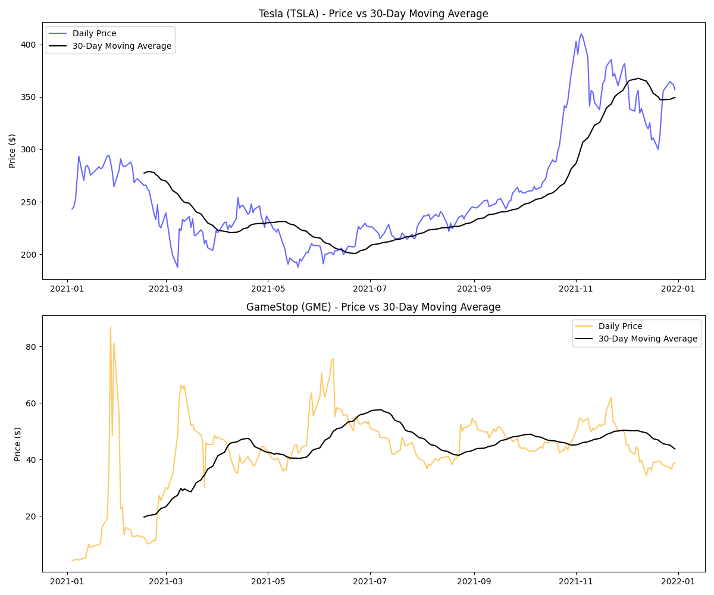
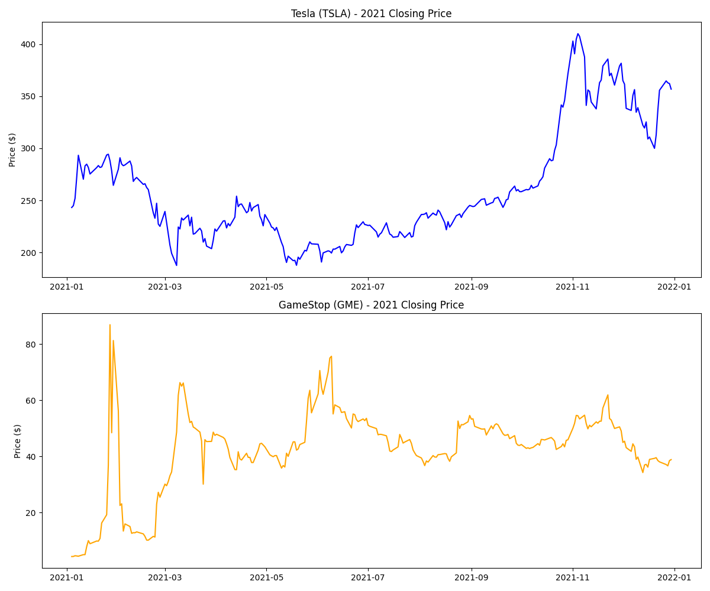

# Tesla-vs-GameStop-Risk-Analysis
Comparing Tesla's fundamentals-driven growth against GameStop's 2021 short squeeze using time series analysis, hypothetical returns, and maximum drawdown to evaluate risk vs reward.
# Tesla vs GameStop: A Tale of Two 2021 Rallies

> Comparing Tesla's sustained growth against GameStop's short squeeze to understand the difference between return and risk.

---

## Project Overview

In 2021, two completely different stocks made headlines for completely different reasons. Tesla climbed steadily on the back of real business growth and investor confidence. GameStop exploded overnight, driven almost entirely by a coordinated retail trading event known as the short squeeze  with almost no connection to the company's actual business performance.

On paper, comparing their year-end returns alone tells a misleading story. This project goes deeper, asking not just "which stock made more money," but "which stock was actually a reasonable investment to hold."

---

## Data

Daily closing prices for Tesla (TSLA) and GameStop (GME) were pulled directly from Yahoo Finance using the `yfinance` Python library, covering the full 2021 calendar year (253 trading days).

---

## Price Comparison

Plotting both stocks on the same axis initially hides GameStop's story entirely, since its price range is dwarfed by Tesla's. Plotting them separately reveals two very different shapes of volatility.

Tesla shows a gradual dip through spring, a recovery through summer, and a sustained climb to its 2021 peak near $410 by November — consistent with a real business growth narrative.

GameStop shows a violent, isolated spike to nearly $87 in late January, a crash back to around $13 within weeks, a second smaller spike in June, and a steady decline through the rest of the year — consistent with a speculative event rather than fundamental business change.

---

## The $1000 Question

A hypothetical $1000 invested in each stock on January 4, 2021 and held until December 30, 2021 would have grown to:

| Stock | Final Value | Return |
|---|---|---|
| Tesla (TSLA) | $1,466.68 | +46.7% |
| GameStop (GME) | $9,004.64 | +800.5% |

At first glance, GameStop looks like the clear winner. But this number only reflects two single days out of an entire year the start and the end. It says nothing about what actually happened in between.

---

## Measuring the Real Risk: Maximum Drawdown

Maximum drawdown measures the largest percentage drop from any peak to the lowest point that follows it essentially, the worst-case loss an investor would have experienced if they bought at the top and didn't sell in time.

| Stock | Maximum Drawdown |
|---|---|
| Tesla (TSLA) | -36.25% |
| GameStop (GME) | -88.32% |

This changes the story significantly. Someone holding GameStop through 2021 would have, at some point, watched their investment lose 88% of its value from its peak. Most investors do not have the patience or risk tolerance to survive a loss that severe without selling — meaning the eventual 800% return was only available to whoever held on through one of the most extreme crashes possible in a single stock.

Tesla's worst drawdown, by comparison, was far more survivable, making its modest 46.7% return arguably a more realistic
